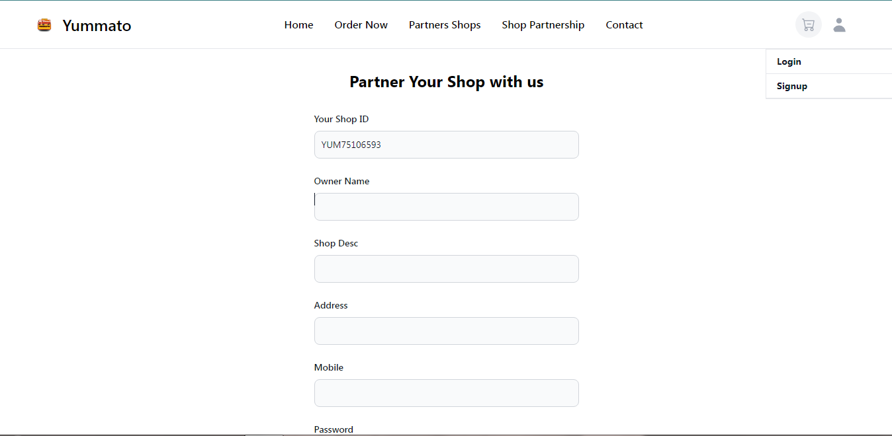
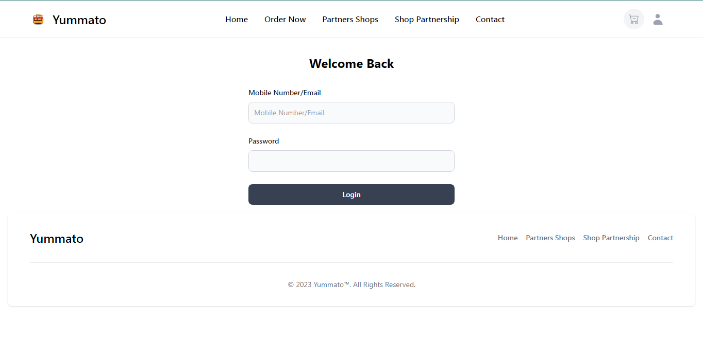
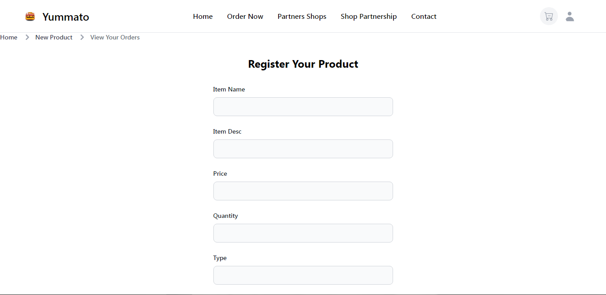
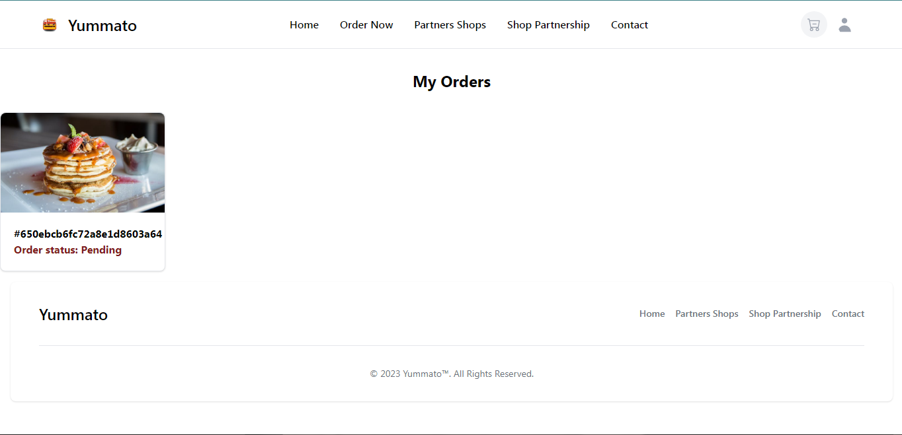
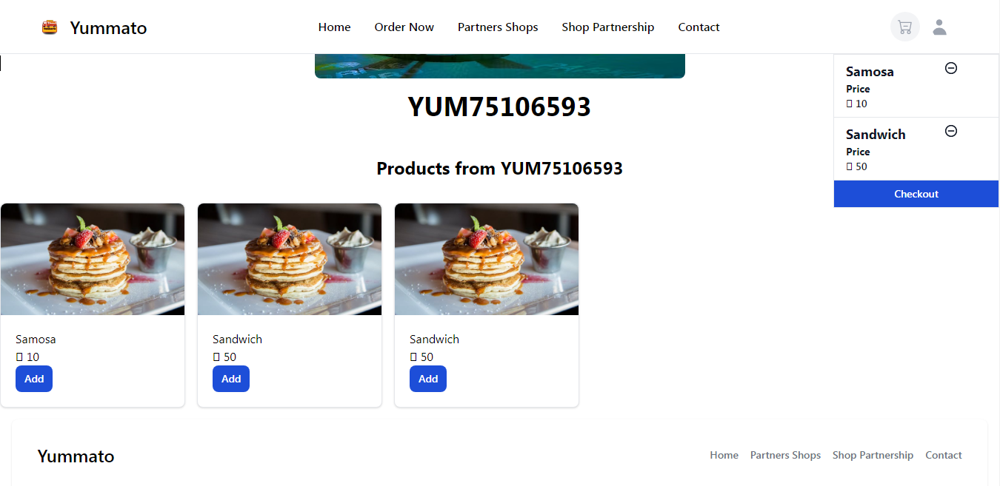
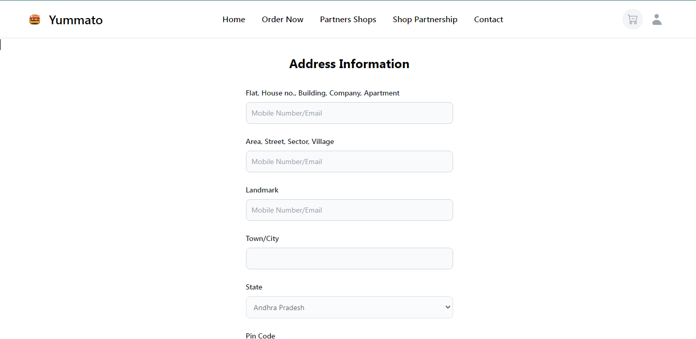
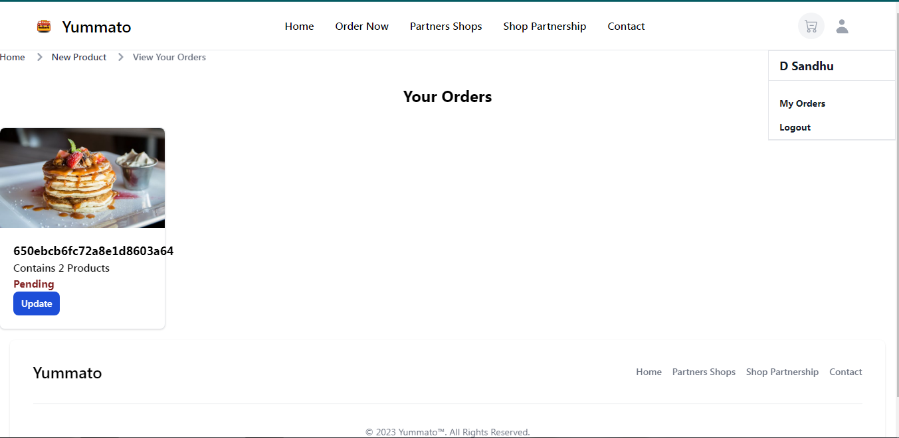

# Yammato 
 
Yummato allows shop owners to easily register their stores once they've logged in or signed up. Users can then explore and order from local shops seamlessly. 
## Tech Stack

**Client:** Nextjs, Tailwind

**Server:** Nextjs API,JWT, Bcrypt, MongoDB, Stripe(Fake Payment)

**Database** MongoDB

## Run Locally

Clone the project 

```bash
 git clone "https://github.com/DuvenderSandhu/Yammato"
```

Go to the project directory

```bash
  cd Yammato
```

Install dependencies

```bash
  npm install bcryptjs,jsonwebtoken,mongoose,nextjs-progressbar,postcss,react,react-dom,react-icons,redux,redux-thunk,stripe,tailwindcss,typescript,postcss,next,eslint-config-next,eslint,autoprefixer,react-redux
```

Start the server

```bash
  npm run start
```

## Screenshots













## Feedback

If you have any feedback, please feel free to talk duvendersandhu@gmail.com
